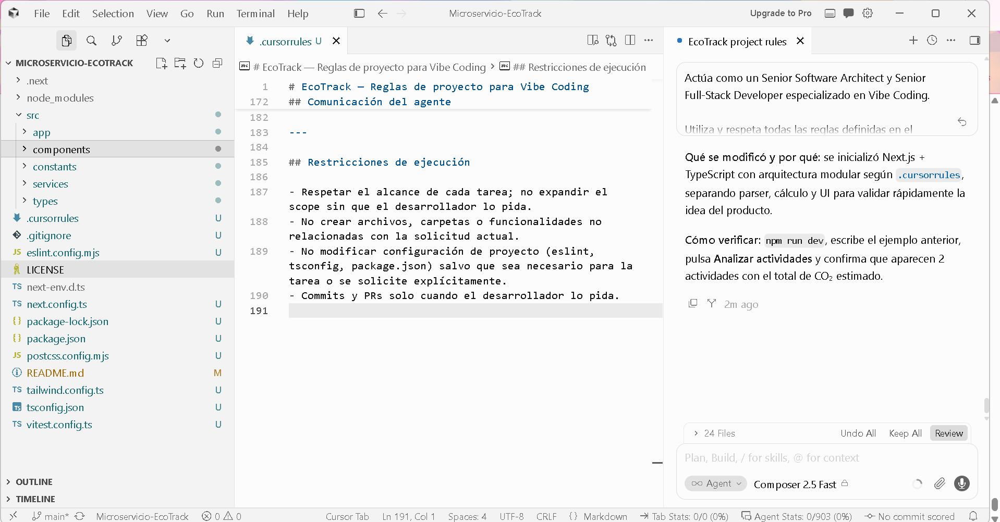
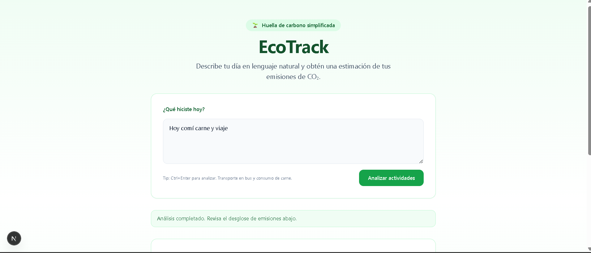
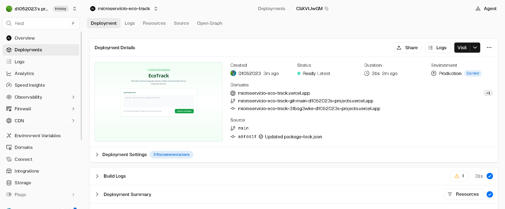

# EcoTrack
## Vibe Report — EcoTrack
### Reflexión sobre la configuración y el flujo de trabajo

## 1. Configuración de las reglas del agente

Para el desarrollo de EcoTrack utilicé Cursor como entorno principal de Vibe Coding. Configuré un archivo `.cursorrules` para establecer las reglas que debía seguir el agente durante el desarrollo.

Las reglas indicaron que el proyecto debía utilizar Next.js, React y TypeScript, manteniendo una arquitectura modular, código limpio y una interfaz sencilla y responsiva. También establecí que EcoTrack debía mantenerse como un MVP, evitando agregar funcionalidades o dependencias que no fueran necesarias.

Además, definí reglas para separar la interfaz de la lógica de negocio, centralizar los factores de emisión de CO₂, utilizar tipado estricto en TypeScript y aplicar buenas prácticas de seguridad. También indiqué que, ante errores, el agente debía analizar el problema y solucionarlo directamente en lugar de requerir correcciones manuales de sintaxis.

## 2. Dificultades encontradas

Una de las principales dificultades fue aprender a delegar correctamente las tareas a la IA. No bastaba con decir qué aplicación quería; era necesario proporcionar contexto, restricciones y objetivos claros para evitar que el agente implementara funcionalidades innecesarias.

También fue necesario revisar constantemente el código generado para verificar que respetara las reglas establecidas. Durante las pruebas surgieron problemas que fueron comunicados al agente mediante mensajes y errores, permitiendo que este analizara y aplicara las correcciones.

Finalmente, para el despliegue utilicé Vercel, conectando el proyecto con el repositorio de GitHub. Esto permitió publicar el MVP y obtener una URL accesible desde Internet.

## 3. Reflexión sobre el Vibe Coding

La experiencia de pasar de escribir código a orquestar una visión cambia la forma de desarrollar software. En lugar de concentrarme en cada línea de código, mi responsabilidad principal fue definir qué debía hacer EcoTrack, cómo debía funcionar y qué características debía tener.

Cursor funcionó como un copiloto capaz de convertir instrucciones de alto nivel en código funcional, mientras que yo asumí el papel de definir la visión, revisar los resultados, probar el sistema y decidir qué debía modificarse.

Considero que el Vibe Coding permite desarrollar prototipos de manera más rápida, pero no significa dejar toda la responsabilidad en la IA. El desarrollador sigue siendo necesario para establecer objetivos, validar las decisiones técnicas y controlar el resultado final.

En conclusión, Vibe Coding consiste en dirigir la IA con una intención clara, utilizando sus capacidades de implementación para convertir rápidamente una idea en un producto funcional.

## 4. Evidencia — Capturas de pantalla

A continuación se incluyen las capturas del entorno de Cursor y Vercel operando en conjunto durante el desarrollo y despliegue de EcoTrack.

**Captura 1 — Entorno de Cursor (agente y reglas configuradas)**

**Captura 2 — Cursor generando/corrigiendo código del proyecto**

**Captura 3 — Despliegue en Vercel (proyecto conectado a GitHub)**

